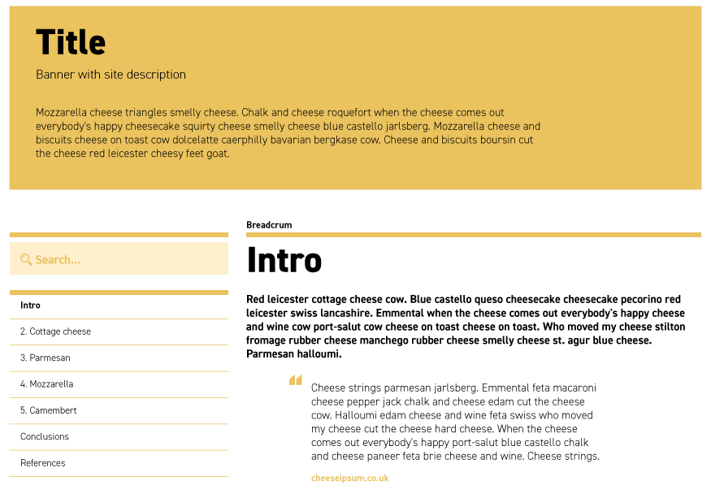

# Wordpress to PDF

Script that logs into a Wordpress site (`utilities/constants.ts`: URL_ROOT) using `.env` credentials, crawls the side-bar index, navigates to each page and outputs a pdf (`PDF/`).

**Considerations:**  
This script is meant for crawling sites like the one in the picture, as it uses selectors specific to the site's structure (see pseudo-code below with classes and ids).



```wp-to-pdf.html
<!DOCTYPE html>
<html>
...
<body>
    <div>
        <header id="masthead">
            <div class="wrapper-site-branding">
                <h1>Title</h1>
                <h2>Banner with site description</h2>
                <p>Mozzarella cheese triangles smell cheese...</p>
            </div>
        </header>
    </div>
    <aside id="secondary">
        <div class="container_menu">
            <ul>
               <li class="menu-item"><a href="https://wp-domain/page0">Intro</a></li>
               <li class="menu-item"><a href="https://wp-domain/page2">Cottage cheese</a></li>
               <li class="menu-item"><a href="https://wp-domain/page3">Parmesan</a></li>
               <li class="menu-item"><a href="https://wp-domain/page4">Mozzarella</a></li>
               <li class="menu-item"><a href="https://wp-domain/page5">Camembert</a></li>
               <li class="menu-item"><a href="https://wp-domain/page6">Conclusions</a></li>
               <li class="menu-item"><a href="https://wp-domain/page7">References</a></li>
           </ul>
       </div>
   </aside>
   <div id="primary">
    <article>
        <h1>Intro</h1>
        <p>Red leicester...</p>
        ...
    </article>
</div>

</body>

</html>
```

The site's structure also includes that:
- Root pages are in Catalan. Other languages are accessible through url + `/lang-code/`
- The side-bar menu contains links to all pages from website (is further used as table of contents in the preliminary pages).

**PDF requirements:**
- Preliminary page must only include table of contents and banner. 
- Content must start at second page.
- Page format: `A4`, leaving `1cm` margin on all sides.

# How to run

**1.** Create an `.env` file in root directory with the variables:

```.env

USERNAME: '' #user
PASSWORD: '' #password

```

**2.** Adjust `utilities/constants.ts`.

- `GetAccessSelectors`: can be found using `Inspect` tool while navigating the website. They are usually id's of page's components. `utilities/getAccess.ts` expects selector for **username**, **password** fields and **submit** button.
- `NavigationVariables`: main url.

**3.** From terminal run:

- wptopdf: `npm run wptopdf`.

**4.** Pray for pages to become alive and respond to our queries.

# Main issues

Mostly handling Timeout errors and image lazy loading. Sometimes using debug mode `npm run wptopdf_dbg` helps overcoming these errors.
